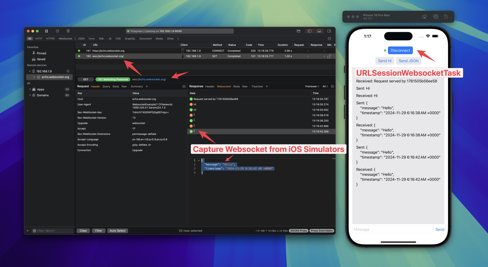

# WebSocket Example App

A simple iOS app demonstrating how Proxyman can capture and debug WebSocket traffic from iOS apps. Works with URLSessionWebSocketTask.

## Requirements

- iOS 17.0+
- Xcode 15.0+
- Swift 5.9+

## Setup

1. Clone the repository
2. Open `WebsocketExample.xcodeproj` in Xcode
3. Follow the instructions in the [Proxyman documentation](https://docs.proxyman.io/advanced-features/websocket) to install Proxyman and set up the SOCKS5 proxy.
4. Run the app and enjoy capturing WebSocket traffic with Proxyman.

## Tutorial

- [How to capture WebSocket traffic from iOS apps with Proxyman](https://proxyman.io/posts/2019-10-18-WebSocket-Debugging)
